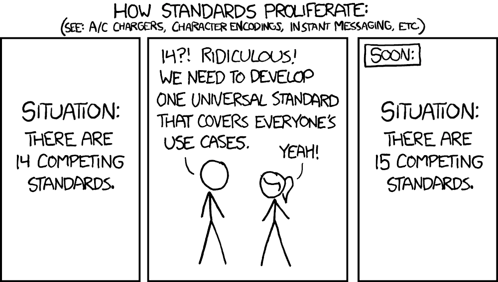

- {:height 295, :width 494}
  id:: 629168a2-5251-438a-983c-1c1a993aeaeb
  (Source: [xkcd](https://xkcd.com/927/))
	- Description: An xkcd webcomic.
	  Title: "How Standards Proliferate (See: A/C chargers, character encodings, instant messaging, etc)"
	  Panel 1: "Situation: There are 14 competing standards."
	  Panel 2: Cueball says, "14? Ridiculous! We need to develop one universal standard that covers everyone's use cases." Ponytail responds, "Yeah!"
	  Panel 3: "(Soon) Situation: There are 15 competing standards."